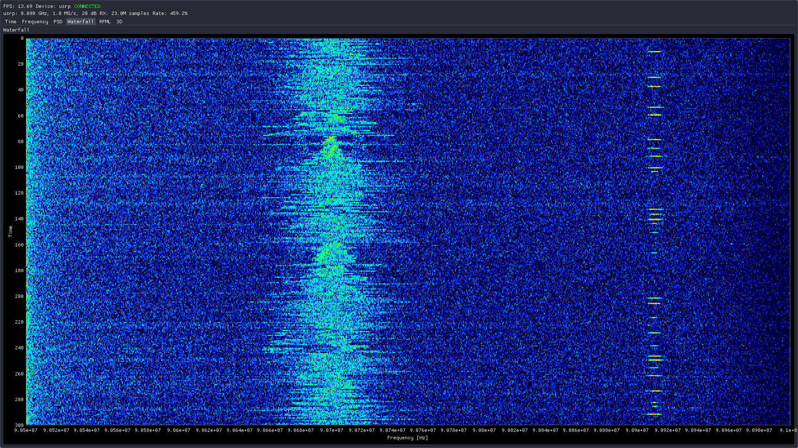
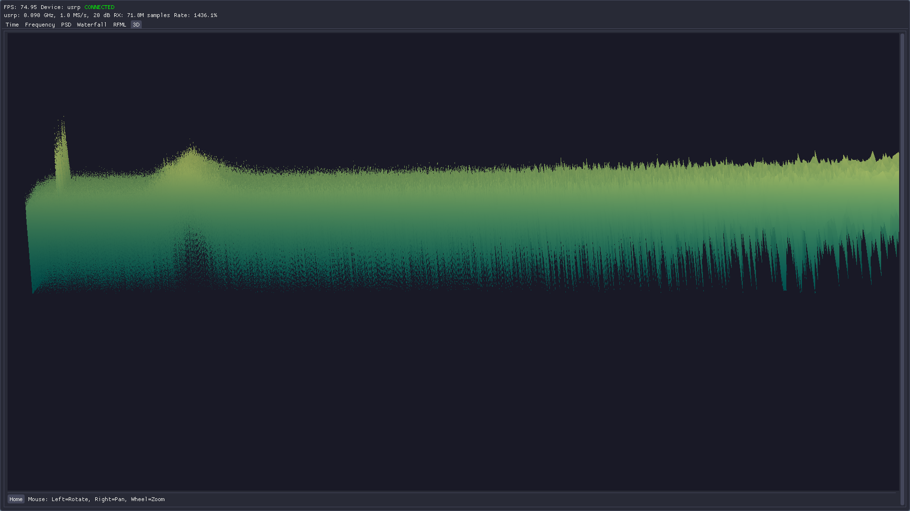

# Osprey

Terribly cute implementation of a real-time software defined radio signal
processing and visualization (2D & 3D spectrogram) application.

<table>
<tr>
<td></td>
<td></td>
</tr>
</table>

---

## Storyline

I set out to write a spectrum analyzer with machine learning capability similar
to [OmniSIG](https://www.deepsig.ai/omnisig/) on a much simpler level. Could you
imagine my face when I realized how difficult it would be to just write a
spectrum analyzer that runs at real time with high FFT size? Anyways this was a
summer project and I failed miserably. Note to future self: learn some of the
foundational stuff before jumping head first if its a big project.

Changes to this projects goals:
+ Real time, 3D spectrogram, ML model detects and classifies signals
+ Real time, high FFT 2D spectrogram, with ML detection
+ Real time, low FFT 2D spectrogram similar to torchaudio

One day I will build a working real time spectrum analyzer with high FFT size!

---

## Technical Implementation

### Hardware Abstraction Layer

+ Abstract class for individual SDR device
+ Automatic SDR recognition and setup
+ Thread safe callback for real-time data streaming
+ USRP B210 support with UHD library
+ Threaded IQ receiver

### Signal processing & Buffer

+ FFT with PFFFT for real time processing
+ STFT spectrogram with overlapping Blackman windows
+ Thread safe lock-based circular buffer with bulk copy
+ Copy latest for pseudo real time display

### Visualization

+ Dear ImGUI and ImPlot for GUI with Dracula theme
+ GLAD, GLFW, OpenGL for window management and rendering
+ Custom spectrogram colorscheme
+ Hardware accelerated 3D spectrogram with movement
